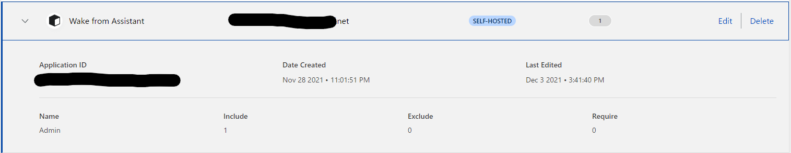
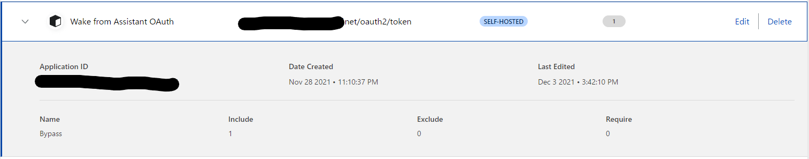
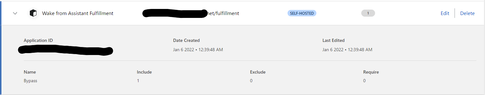
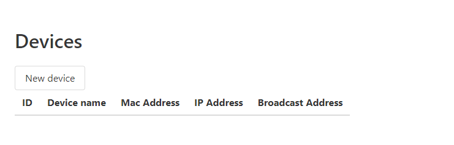
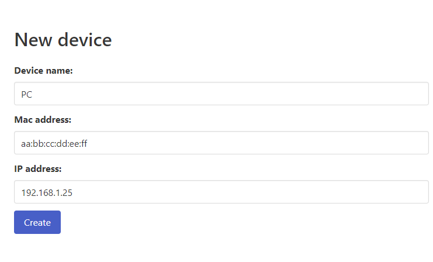

# Wake from Assistant

Wake on LAN integration for Actions on Google : Wake your computer via Google Assistant!

## Requirements

* A server to run this application
  * Docker installed
  * Docker Compose recommended (but not required)
  * Must be in the same network with your computers
* [Google Cloud](https://cloud.google.com/) account
  * Must use the Google account on your Google Assistant device
* A domain to publish this application
  * For your safety, protecting by [Cloudflare Access](https://www.cloudflare.com/ja-jp/products/zero-trust/access/) is recommended
  * This application also have the least protection by username and password

> **Note**
>
> If you want to run without Docker, you can use `./gradlew bootRun` but no supports available. Do at your own risk!

## How to use

### Prepare Actions on Google project

Access to [Actions Console](https://console.actions.google.com/).
Click <kbd>New project</kbd> to create new project.
Give some name and hit <kbd>Create project</kbd>.

Select **Smart Home** and click <kbd>Start building</kbd> button.

### [Optional] Configure Cloudflare Access

Go to [Cloudflare Zero Trust Dashboard](https://dash.teams.cloudflare.com/) and open **Access** > **Applications**.
You have to create these 3 applications on the dashboard.

* Wake from Assistant (**Protected** web interface)
  * Leave **Path** blank
* Wake from Assistant OAuth (**NOT protected** for OAuth)
  * Must set **Path** to `oauth2/token`
* Wake from Assistant Fulfillment (**NOT protected** for API access)
  * Must set **Path** to `fulfillment`

To create these applications, click <kbd>Add an application</kbd>.
Select type **Self-hosted**, give some name and subdomain.
Fill **Path** field for **NOT protected** applications.
Leave it blank for **protected** main application.

Then, you have to configure some identity providers.
You can choose many way to authenticate, so do as your wish.

To configure the policy for **protected** application, select **Allow** for the **Action** and assign a group.
To configure the policy for **NOT protected** applications, select **Bypass** for the **Action** and give **Everyone** for the additional rule.

After configuring application, your **Applications** will look like this:





Then, go to **Access** > **Tunnels** in the sidebar.
Click <kbd>Create a tunnel</kbd> to create a tunnel and give some name to your tunnel.
Copy your token from **Install and run a connector** section, this token will be required later.

In **Public Hostnames** tab, configure subdomain and domain as you configured in **Applications**.
Leave **Path** field blank.

### Boot the application

> **Warning**
>
> This section is written to use docker compose and cloudflare tunnel.
> If you do not want to use, please replace them properly.

We are providing a template of [docker-compose.yml](docker-compose.yml).
Copy this file into your server and **configure it properly**.
You must provide **Cloudflare Tunnel Token** and prepare destination directory of the H2 database (for example, run `mkdir h2`).

After configuring `docker-compose.yml`, you can boot the application.

```shell
docker compose up -d
docker compose logs -f wake-from-assistant
```

Typing this command produces many log outputs.
Please find a line with `== OAuth Client Information ==`, and remember 4 credentials below.

```text
wake-from-assistant-wake-from-assistant-1  | 2022-07-01 03:27:00.559  INFO 1 --- [           main] n.a.w.WakeFromAssistantApplication       : == OAuth Client Information ==
wake-from-assistant-wake-from-assistant-1  | 2022-07-01 03:27:00.560  INFO 1 --- [           main] n.a.w.WakeFromAssistantApplication       : Client ID         : CLIENT_ID_HERE
wake-from-assistant-wake-from-assistant-1  | 2022-07-01 03:27:00.561  INFO 1 --- [           main] n.a.w.WakeFromAssistantApplication       : Client secret     : CLIENT_SECRET_HERE
wake-from-assistant-wake-from-assistant-1  | 2022-07-01 03:27:00.561  INFO 1 --- [           main] n.a.w.WakeFromAssistantApplication       :
wake-from-assistant-wake-from-assistant-1  | 2022-07-01 03:27:00.561  INFO 1 --- [           main] n.a.w.WakeFromAssistantApplication       : == User Login Information ==
wake-from-assistant-wake-from-assistant-1  | 2022-07-01 03:27:00.562  INFO 1 --- [           main] n.a.w.WakeFromAssistantApplication       : User ID           : USER_ID_HERE
wake-from-assistant-wake-from-assistant-1  | 2022-07-01 03:27:00.563  INFO 1 --- [           main] n.a.w.WakeFromAssistantApplication       : User password     : USER_PASSWORD_HERE
```

> **Note**
>
> If you failed to get these credentials, reset the database and try again.
>
> ```shell
> docker compose down   # stop the application
> rm -rf ./h2   # remove database directory
> mkdir ./h2   # recreate database directory
> ```

### Configure the application

Access to `https://your.domain/devices` will show you Cloudflare Access login.
After passing Cloudflare Access, you will see the second login.
You have to type **User ID** and **User password** obtained in previous step.

If you see a page like this, a remaining thing you have to do is set your computer up by hitting <kbd>New device</kbd>.



Configure like this in **New device**.



### Configure Actions on Google

Open **Invocation** page in **Develop** tab.
Give some name to the app.
This will be shown on the Home app.

Go to **Actions** page.
Set **Fulfillment URL** to `https://your.domain/fulfillment`.

Then in the **Account linking** page, fill the **OAuth Client Information** form.
See below for values.

* **Client ID**: `google`
* **Client secret**: Previously remembered **Client Secret** on the application setup.
* **Authorization URL**: `https://your.domain/oauth2/authorize`
* **Token URL**: `https://your.domain/oauth2/token`
* **Use your app for account linking**: Leave them blank.
* **Scopes**: `openid`

After configuring these values, click <kbd>Test</kbd> on the header.

Open the Home app on your phone, go to **Smart Home** integrations page.
Search for `[test]` will list your app, so click it to link an account.

It will show your computers on the Home app, so that you can turn them on.

## License

```
    Wake from Assistant
    Copyright (C) 2021  Team AccelForce

    This program is free software: you can redistribute it and/or modify
    it under the terms of the GNU Affero General Public License as published
    by the Free Software Foundation, either version 3 of the License, or
    (at your option) any later version.

    This program is distributed in the hope that it will be useful,
    but WITHOUT ANY WARRANTY; without even the implied warranty of
    MERCHANTABILITY or FITNESS FOR A PARTICULAR PURPOSE.  See the
    GNU Affero General Public License for more details.

    You should have received a copy of the GNU Affero General Public License
    along with this program.  If not, see <https://www.gnu.org/licenses/>.
```
